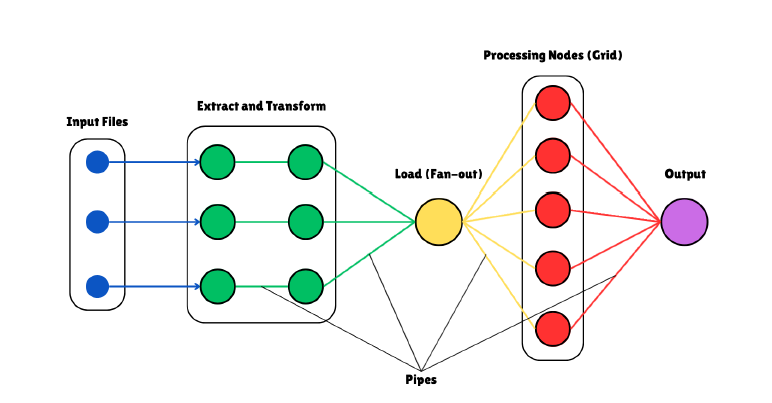

# Pipeline Processing System


## Overview

This project implements a pipeline-based data processing system in C++, where input CSV files are passed through multiple stages: extract and transform, load balancing, grid-based processing, and final output. The system utilizes unnamed UNIX pipes and process forking to achieve inter-process communication (IPC) and concurrency.

---

## Components

### 1. Input

The user provides CSV files as input through command-line arguments. These are passed to the extract and transform stage.

### 2. Extract and Transform

Each input file is handled by a forked child process executing the `extract_transform` binary. This binary reads, cleans, and prepares the data.

* Each child writes its output to `pipe1`, which merges all extract-transformed data.

### 3. Load Balancer

The `load_balancer` binary receives the merged data via `pipe1`.

* It distributes the data evenly to different grid nodes for parallel processing.
* It writes the balanced output to `pipe2`.

### 4. Grid Processing Nodes

The `grid_node` binary reads the load-balanced data from `pipe2`.

* Performs intensive computations or analysis.
* Writes results to `pipe3`.

### 5. Final Output

The `final_output` binary reads the processed data from `pipe3` and outputs it in a final format (e.g., to stdout or a file).

---

## Pipe Architecture

The pipeline is built using three unnamed pipes:

| Pipe    | Source Process      | Destination Process | Description                         |
| ------- | ------------------- | ------------------- | ----------------------------------- |
| `pipe1` | `extract_transform` | `load_balancer`     | Merges transformed CSV data         |
| `pipe2` | `load_balancer`     | `grid_node`         | Distributes data to grid processing |
| `pipe3` | `grid_node`         | `final_output`      | Forwards results to output stage    |

### Note:

All pipes are unnamed and created using the `pipe()` system call. They are used for temporary inter-process communication and are closed after their purpose is fulfilled to prevent resource leakage and ensure EOF signaling.

---

## Diagram Interpretation

The diagram represents a flow-based architecture:



* **Blue Dots:** Input files.
* **Green Circles:** `extract_transform` processes.
* **Yellow Circle:** `load_balancer`.
* **Red Circles:** Grid nodes (`grid_node`).
* **Purple Circle:** `final_output`.
* **Lines:** Unnamed pipes connecting each stage.

Each pipe is directional and ensures that output from one stage is fed directly as input to the next.

---

## Why We Close Pipes

Closing unused pipe ends is critical:

* Prevents resource leaks.
* Ensures EOF is detected correctly.
* Avoids blocking behavior in read/write.

For instance:

* A writer process must close the read end of the pipe.
* A reader process must close the write end of the pipe.

---

## Execution Flow Summary

```bash
./run_pipeline input1.csv input2.csv input3.csv
```

1. Parent process creates all pipes.
2. A merger process forks multiple `extract_transform` children, each processes a file and writes to `pipe1`.
3. `load_balancer` reads from `pipe1`, balances the workload, writes to `pipe2`.
4. `grid_node` reads from `pipe2`, processes data, writes to `pipe3`.
5. `final_output` reads from `pipe3` and outputs the final result.

---

## Conclusion

This project demonstrates a modular and scalable approach to data processing using UNIX concepts like process forking and unnamed pipes. It ensures parallelism, resource control, and clear separation of concerns across each stage in the pipeline.

---

## Future Enhancements

* Add named pipes for persistent IPC.
* Introduce logging and monitoring.
* Implement fault tolerance and retries for failed nodes.
* Expand grid node scalability dynamically.
