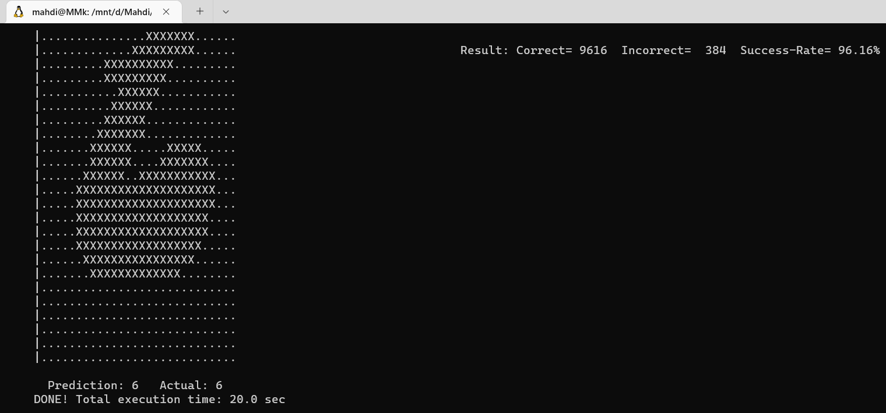
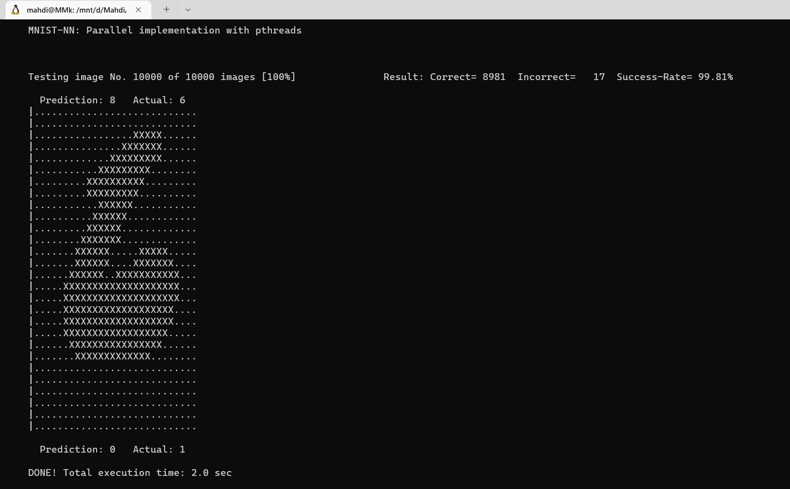
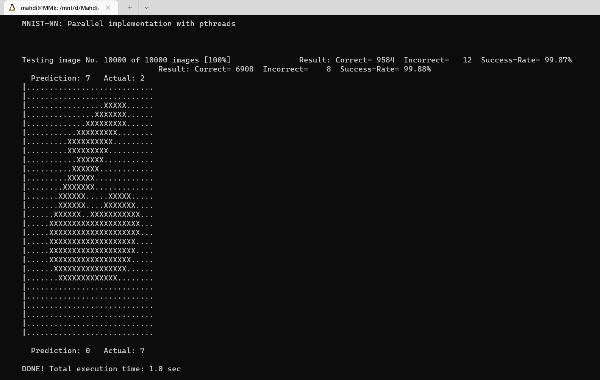

# Performance Report: Serial vs Parallel Execution

## Overview

- **Serial Execution Time**: 20 seconds  
- **Parallel Execution Time**: 2 seconds

## Speedup Calculation

Speedup is calculated using the formula :

- Speedup = Serial Time / Parallel Time = 20 / 2 = 10

So, the parallel  program achieved a **10x speedup**.

## Explanation of Speedup

This speedup happens because the parallel version utilizes multiple cores or processors to execute parts of the task simultaneously, rather than one after another. Here's why this leads to better performance:

1. **Concurrency**: Tasks that can be done independently are distributed across multiple threads or processes, so they finish faster.
2. **Resource Utilization**: Modern CPUs have multiple cores. Serial code uses only one, while parallel code can use many.
3. **Reduced Idle Time**: While one part of the task is waiting (e.g., for I/O), other parts can still proceed in parallel.

## Why It's Not Always Perfect

Although I achieved a very good speedup (10x), parallelism isn't always linear due to:

- Overhead of managing threads or processes
- Limited number of CPU cores
- Non-parallelizable portions of code

## Conclusion

The results clearly show that the task benefits greatly from parallel execution, achieving a **10x speedup**, which significantly reduces the runtime and improves performance.
